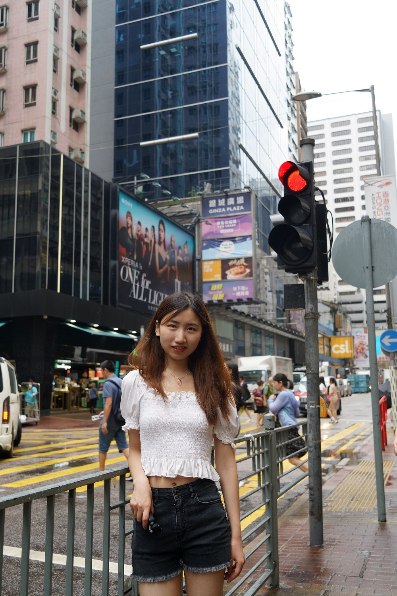
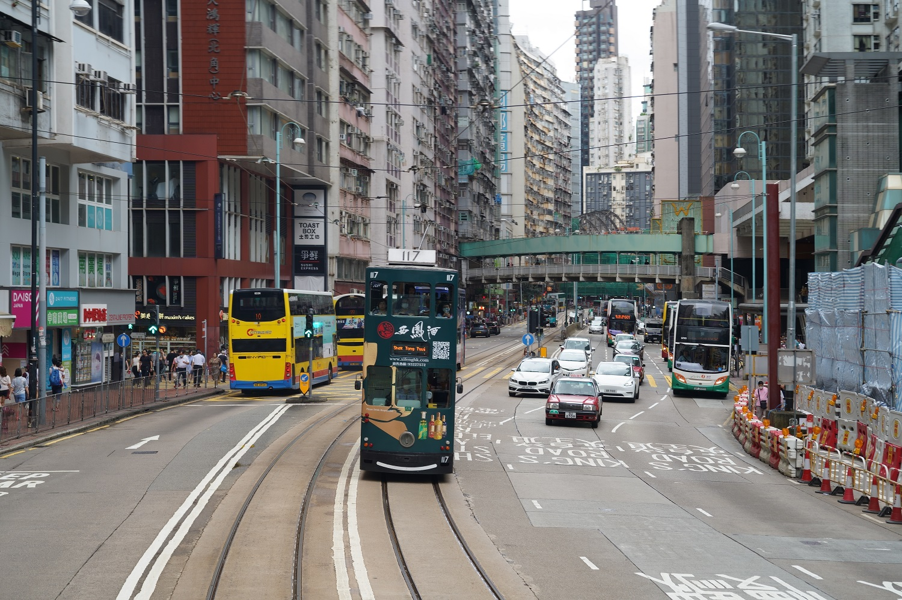

今年6月中旬，很早规划的香港之行终于开启了。这次旅行，我们在香港只有三天的时间，因为不想赶在节假日去，人太多，啥都贵。在出发前，我们在网上搜集了很多资料，很多人都说香港人看不起内地人，态度恶劣之类的，所以原本的期待变成了忐忑。

我们想去看看资本主义到底长啥样，香港真像网上言论般那样动乱吗？

只能说，真要少在网上冲浪，尤其是看那些带个人主观色彩的言论，虚假的信息泛滥，我们的认知很容易受到这些的影响，网上那些信息很明显是有人刻意为之，故意放大，唯恐天下不乱。

去了之后才发现，哪里都有好人，也都有坏人，我们对一座城市的印象，对在那里生活的人的看法，不应该被网上的只言片语带风向，对他们产生误解，这对他们是不公平的。

我们刚落地香港，由于不熟悉繁体字，找不到出口，遇到了非常热心的机场值勤人员；出了机场又有一个小帅哥主动帮我们指路；在公交车上看到了为一个没有零钱的乘客主动支付车费的热心肠举动

当然

也看到了在这座极度**繁忙拥挤**的城市下努力求生存的人类，看到了他们的些许冷淡、没有耐心和脾气暴躁，但这都只是少数，是再正常不过的现象了

当我们去到一个陌生的地方，我们的感官会被放大，我们对事物的误解也会被放大，所以，一定要保持理智，多换位思考。

这段旅行下来，香港给我的印象是**拥挤、生活节奏快、高消费高工资、多元化**，香港有很多外国人在那里从事各种各样的职业，有机场值勤、建筑工人、外卖小哥，还有非常多的菲佣，这点倒是第一次见。

